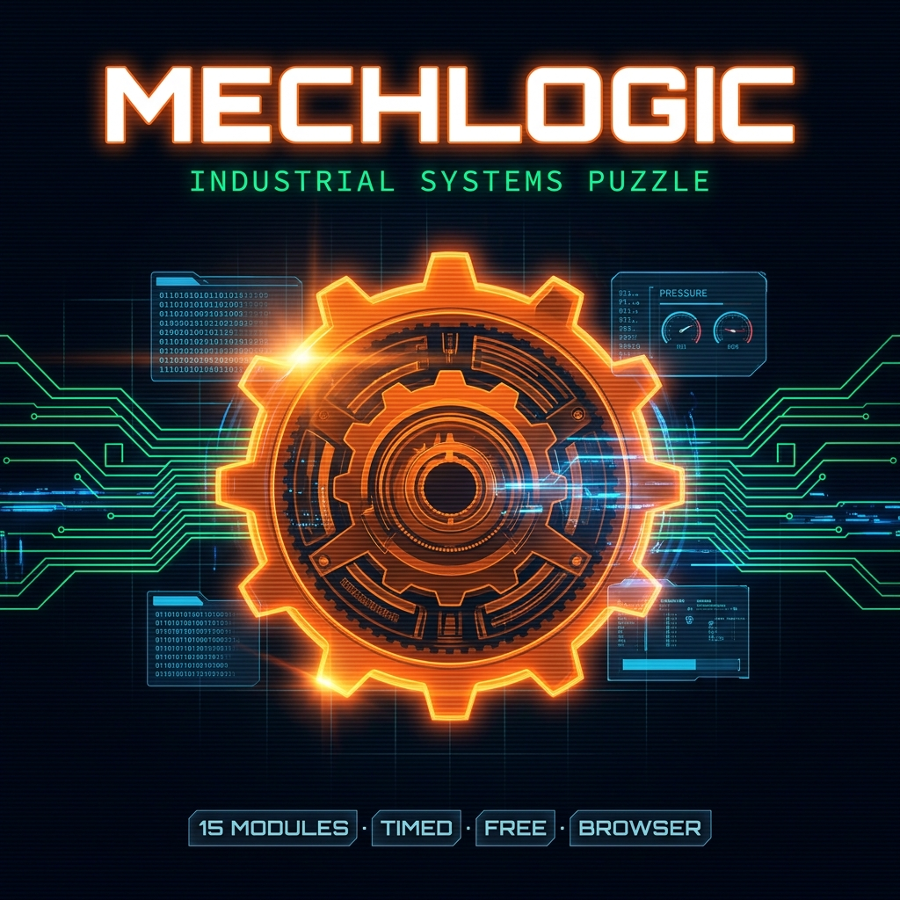

# ⚙️ MechLogic

**Industrial Systems Puzzle · 15 Modules · No Mercy**

MechLogic is a high-stakes, browser-based cyberpunk puzzle game where you step into the shoes of a factory engineer. Your mission is simple but stressful: calibrate 15 increasingly complex industrial subsystems before the clock runs out. 

If you enjoy games like *Keep Talking and Nobody Explodes*, MechLogic offers a similar adrenaline-fueled experience focusing on logic, math, and quick thinking.



## 🚀 Game Overview

In MechLogic, you are racing against time to prevent a total system collapse. Each of the 15 modules is a self-contained challenge with its own mechanics and set of constraints. To pass a module, you must satisfy all live constraints simultaneously and submit your configuration before the timer hits zero.

### 🛠 Key Mechanics
- **Life System:** You start with **3 lives**. Time out on a module, and you lose one. Lose all three, and it's Game Over.
- **Timed Challenges:** Modules range from **35 to 75 seconds**. Efficiency is key to beating your own factory record.
- **Constraint Panels:** Real-time indicators (✔/✘) tell you which parameters are satisfied. Submit only when everything is green!
- **Boss Levels:** Modules **05** and **15** are Boss Levels. These feature real-time core stability drain and higher stakes.
- **Procedural Audio:** Immersive 8-bit sound effects generated in real-time via the Web Audio API.

## 🧩 The Module Manifest

Face 15 unique challenges across different disciplines:
- **Logic & Boolean:** Circuit Routers, Logic Arrays, and Binary Matrices.
- **Mechanical & Physics:** Gear Locks, Balance Beams, and Pipe Routers.
- **Math & Electronics:** Thermal Cores, Equation Locks, and Voltage Dividers.
- **Memory & Optics:** Echo Protocols and Laser Redirects.
- **Chemical:** High-precision reagent mixing in the Chem Reactor.
- **The Bosses:** The Reactor Meltdown and the Omega Protocol.

## 💻 Getting Started

### For Players (No Setup Required)
Since MechLogic is built for the browser, you don't need to install anything:
1. Navigate to the `dist/` folder.
2. Double-click `index.html`.
3. Open it in any modern web browser (Chrome, Firefox, Edge).
4. Click **BOOT SYSTEM** and start calibrating!

### For Developers
If you want to run the project in development mode or modify the code:

1. **Clone the repository:**
   ```bash
   git clone https://github.com/your-username/mechlogic.git
   cd mechlogic
   ```

2. **Install dependencies:**
   ```bash
   npm install
   ```

3. **Run the development server:**
   ```bash
   npm run dev
   ```
   The game will be available at `http://localhost:5173`.

4. **Build for production:**
   ```bash
   npm run build
   ```

## 🛠 Tech Stack

- **Rendering:** [Three.js](https://threejs.org/) (3D Visuals)
- **Build Tool:** [Vite](https://vitejs.dev/)
- **Frontend:** Vanilla JavaScript, HTML5, CSS3
- **Audio:** Web Audio API (Procedural SFX)
- **Fonts:** Orbitron, Rajdhani, Share Tech Mono (Google Fonts)

## 📁 Project Structure
- `src/` - Source code (Main logic, styles, and assets).
- `public/` - Static assets.
- `dist/` - Production-ready build (single-file bundle).

---
*Designed for those who love logic, machinery, and the pressure of a ticking clock.*